# okta-wordpress-oidc-lab
## Okta OIDC SSO Integration with WordPress (miniOrange)

This project demonstrates a full **OpenID Connect (OIDC)** Single Sign-On (SSO) integration between **Okta** (Identity Provider) and **WordPress** (Service Provider) using the **Authorization Code Flow** via the **miniOrange OAuth SSO plugin**.

It includes:

- Okta OIDC app configuration  
- Authorization Server + Claims setup  
- WordPress + miniOrange configuration  
- Attribute mapping  
- User provisioning  
- SP‑initiated login flow  
- IdP‑initiated limitations  
- Troubleshooting  
- Screenshots for every step  

---

##  Architecture

```
User → WordPress → Okta → WordPress
           (OIDC Authorization Code Flow)
```

- Identity Provider (IdP): Okta  
- Service Provider (SP): WordPress  
- Protocol: OpenID Connect  
- Flow: Authorization Code  

---

##  Technologies Used

- Okta Developer Tenant  
- WordPress (LocalWP)  
- miniOrange OAuth SSO Plugin (Free)  
- OIDC Authorization Code Flow  

---

##  Setup Steps

---

## 1. WordPress Setup

### 1.1 Download WordPress
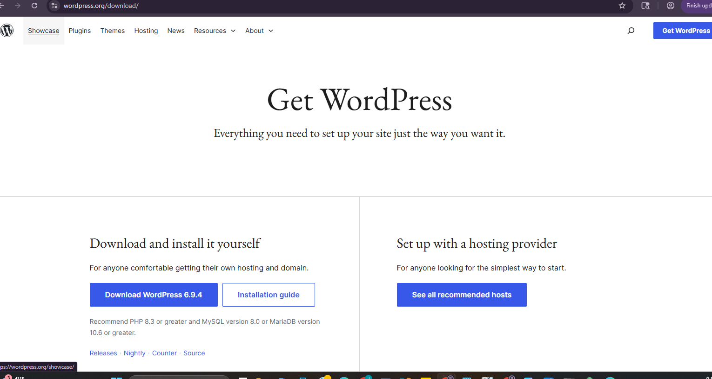

### 1.2 Create Local Site (LocalWP)
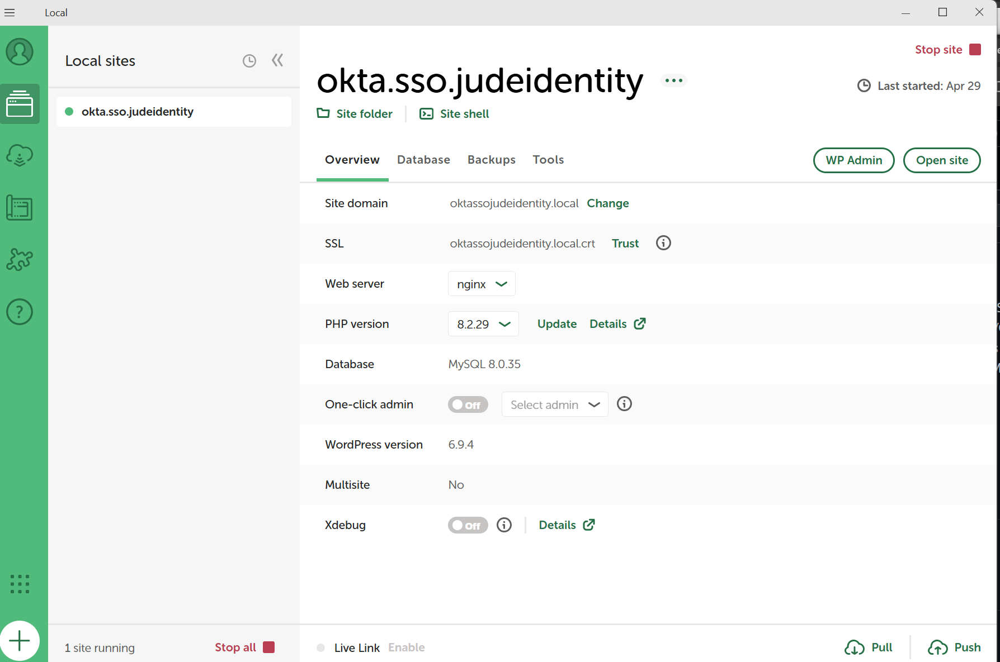

### 1.3 WordPress Admin (Local Admin Account)
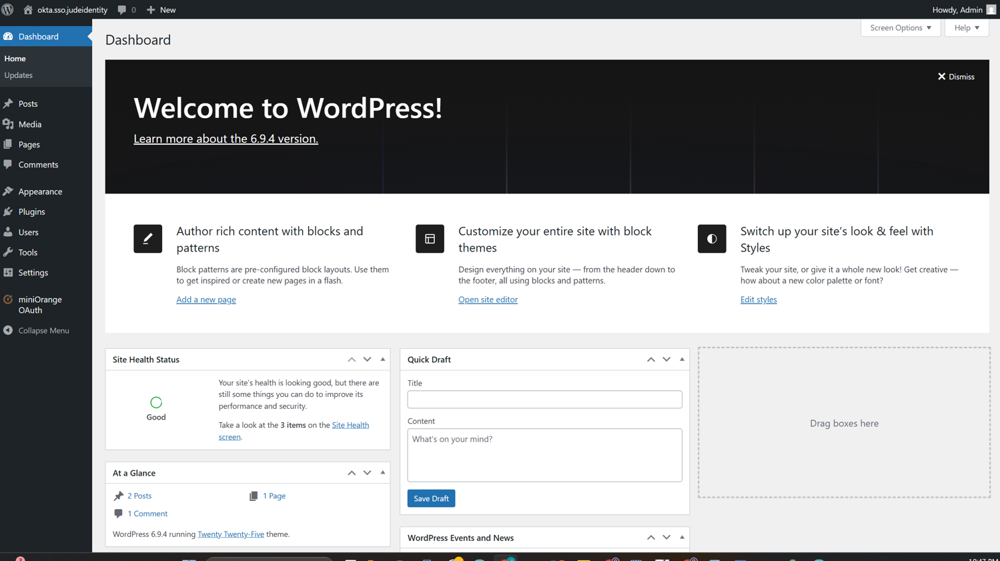

---

## 2. Okta OIDC Application Setup

### 2.1 General Settings
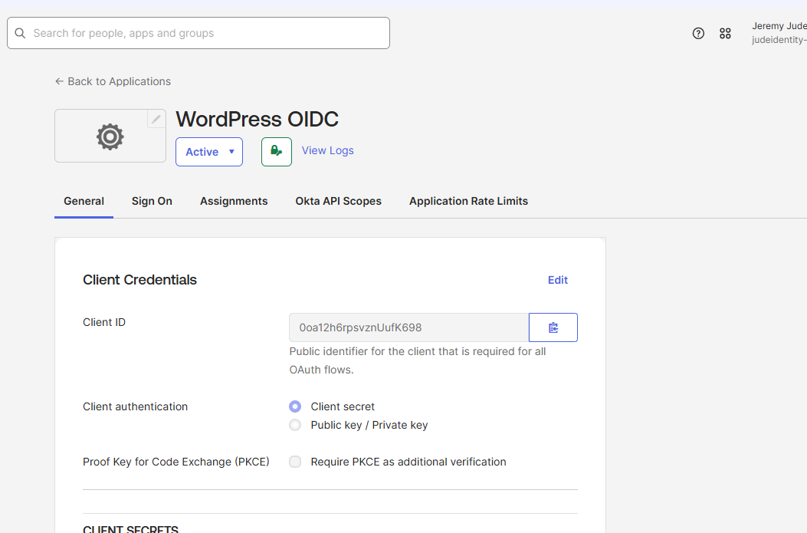

### 2.2 Client Credentials
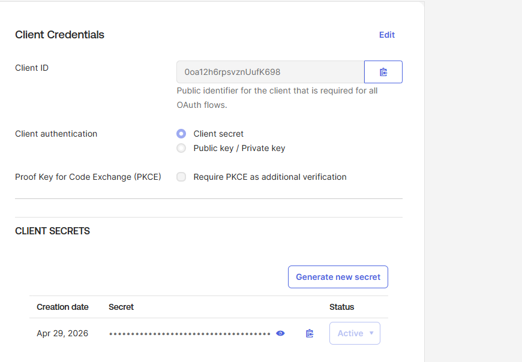

### 2.3 Client Secret
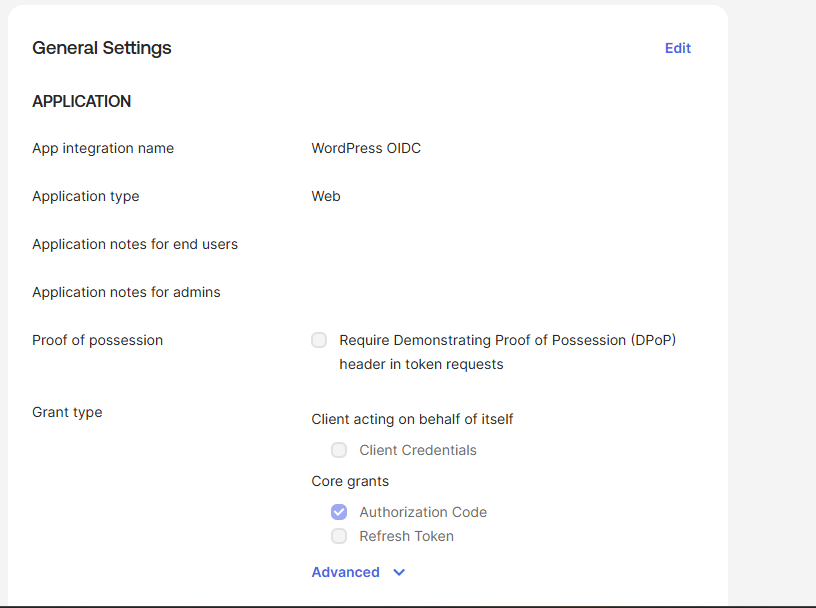

### 2.4 Grant Types


### 2.5 Login Settings
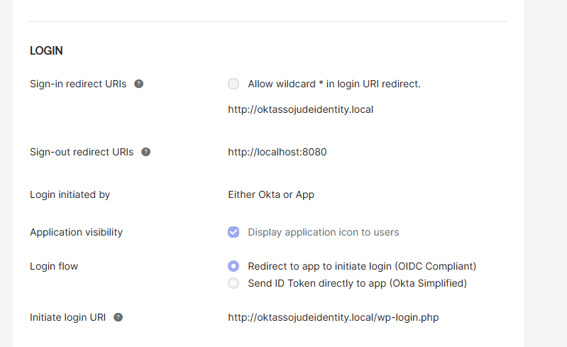

### 2.6 Group Assignment (Executives)
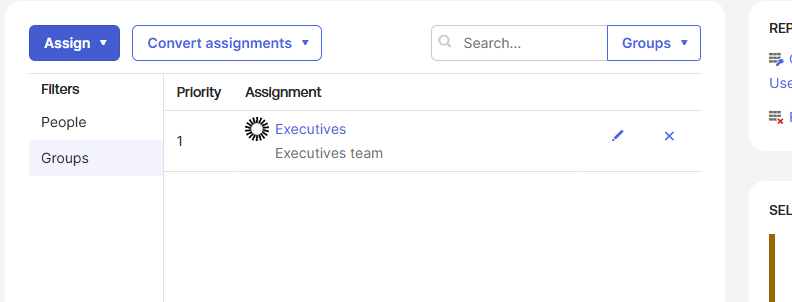

---

## 3. Okta Authorization Server

### 3.1 Authorization Server Settings
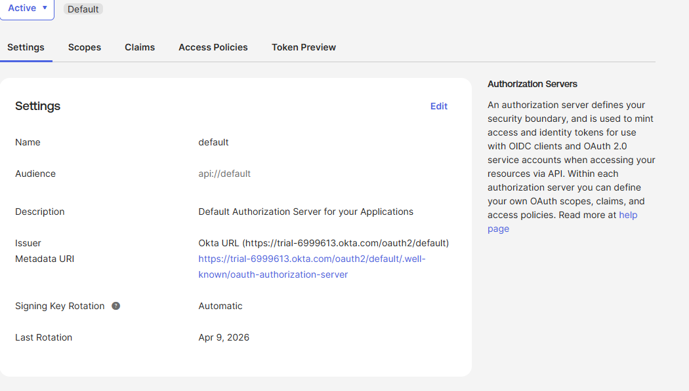

### 3.2 Claims Configuration
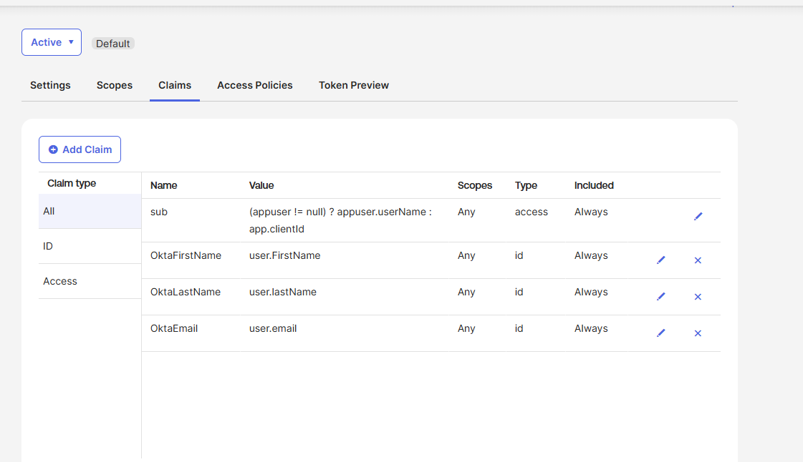

Claims added:

| Claim Name       | Value           | Included In |
|------------------|------------------|-------------|
| OktaFirstName    | user.firstName   | ID Token    |
| OktaLastName     | user.lastName    | ID Token    |
| OktaEmail        | user.email       | ID Token    |

---

## 4. miniOrange Plugin Configuration

### 4.1 OAuth Provider Setup
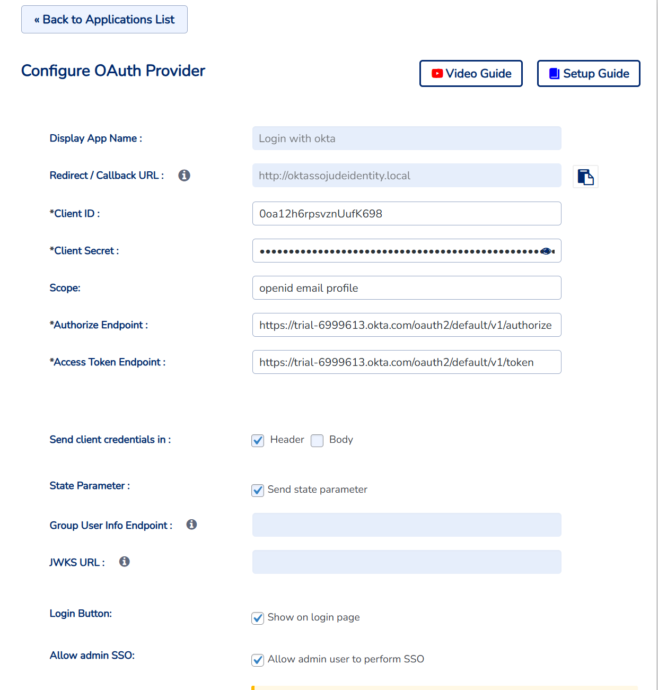

### 4.2 Attribute Mapping
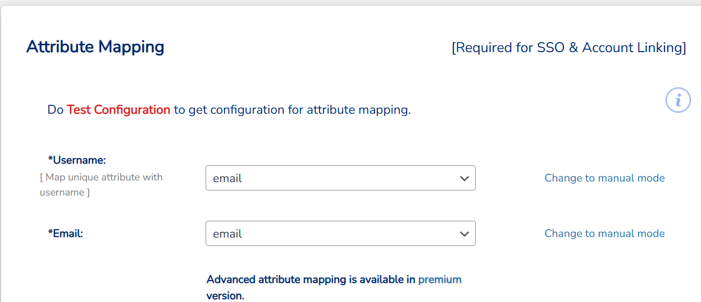

Mappings used:

- Username → email  
- Email → email  
- First Name → given_name  
- Last Name → family_name  

---

## 5. SSO Flow

### 5.1 Okta User Dashboard (Assigned App)
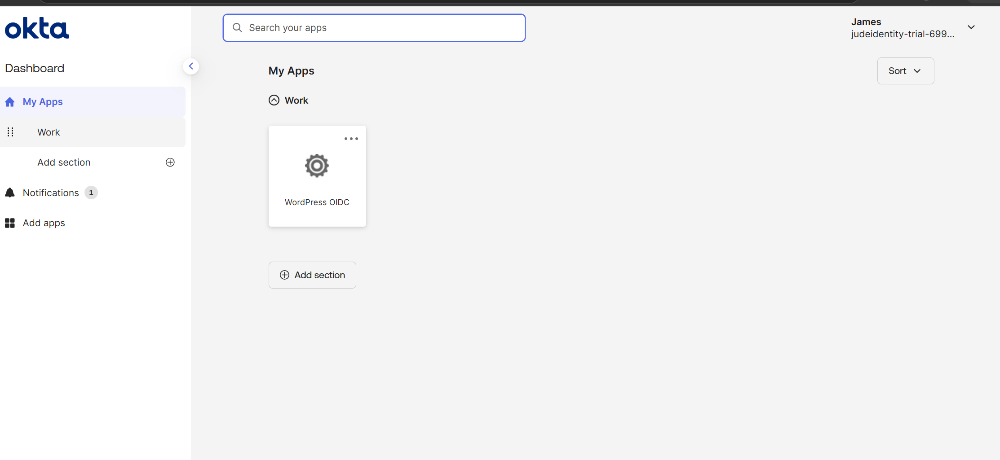

### 5.2 WordPress Login Page
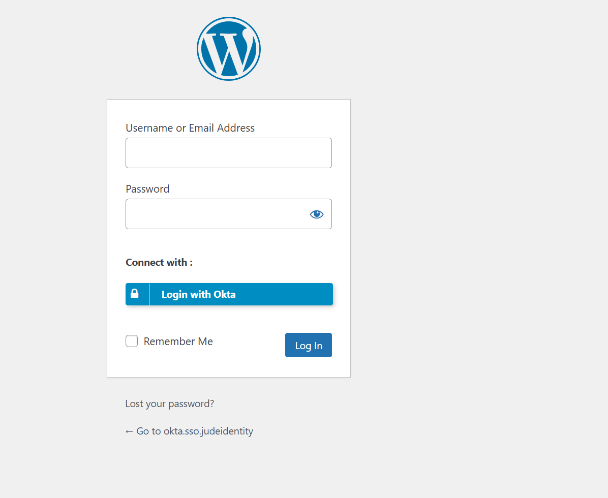

## 5.3 Test User WordPress Front end Page (After SSO login)
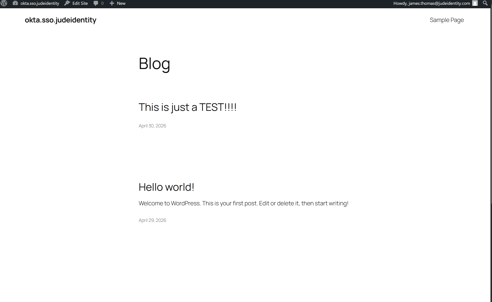

## 5.4 Test User Admin Dashboard 
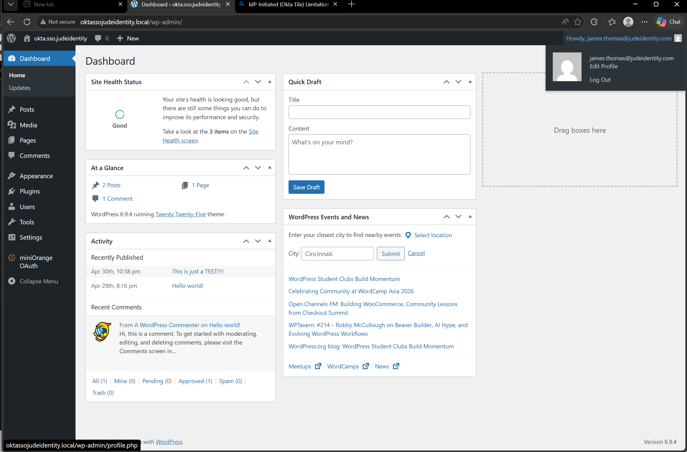


---

##  SP‑Initiated SSO Flow (Working)

1. User visits WordPress login page  
2. Clicks **Login with Okta**  
3. Redirects to Okta  
4. User authenticates  
5. Okta returns ID Token  
6. WordPress auto‑creates user + logs them in  

---

##  IdP‑Initiated Flow Limitation (Okta Tile)

Clicking the WordPress tile in Okta:

- Redirects user to WordPress  
- **Does NOT automatically log them in**  
- User must still click **Login with Okta**  

Reason:

> miniOrange free plugin does **not** support full IdP‑initiated OIDC.

---

## 👤 User Provisioning

### WordPress Users List
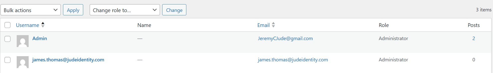

**Test User Used:**  
- Name: **James Thomas**  
- Email: **james.thomas@judeidentity.com**  
- Provisioned: Automatically via SSO  
- Role: Administrator (assigned manually for testing)

---

## Testing Results

###  Successful
- SP‑initiated login  
- User auto‑provisioning  
- Claims mapping  
- Admin access after role assignment  

###  IdP‑initiated login  
- Redirect works  
- Auto‑login does not (plugin limitation)  

---

##  Troubleshooting

### 1. “Unable to sign in”
Cause: Wrong issuer  
Fix:  
Use exact issuer:  
`https://trial-6999613.okta.com/oauth2/default`

### 2. WP0005 / Invalid Login Attempt
Cause: Wrong attribute mapping  
Fix: Username → email

### 3. Username Not Received
Cause: Custom claims mismatch  
Fix: Use standard OIDC claims

### 4. Redirect Issues
Cause: Redirect URI mismatch  
Fix: Ensure exact match in Okta + miniOrange

### 5. Frequent Password Prompts
Cause: No Okta session  
Fix: Log into Okta first (non‑incognito)

---

##  IAM Concepts Demonstrated

- OIDC Authorization Code Flow  
- ID Token vs Access Token  
- Claims & Attribute Mapping  
- Authentication vs Authorization  
- IdP vs SP Initiated Flows  
- Session Management  
- JIT User Provisioning  

---

## 🧠 Lessons Learned

### IdP‑Initiated (Okta Tile) Limitation with OIDC

One of the biggest takeaways from this project was discovering that **OIDC does not support true IdP‑initiated login**, even though SAML does. This wasn’t obvious at first — especially because Okta *lets you create an app tile* for an OIDC integration, which makes it feel like IdP‑initiated login should “just work.”

Here’s what I learned:

- Clicking the Okta tile **does not** complete authentication for OIDC apps  
- The user is redirected to WordPress, but **no OIDC request exists yet**  
- WordPress (via miniOrange) cannot complete login without an **SP‑initiated authorization request**  
- The user must still click **“Login with Okta”** to start the Authorization Code Flow  
- This is not a bug — it’s a **protocol limitation**, not an Okta or plugin issue  

### Why This Happens

OIDC requires the **client (WordPress)** to initiate the flow:

- The SP must generate a `state` and `nonce`  
- The SP must redirect the user to the authorization endpoint  
- The IdP cannot generate these values on behalf of the SP  
- Therefore, IdP‑initiated login is **not part of the OIDC spec**

SAML supports IdP‑initiated login.  
OIDC does **not**.

### What This Means in Practice

- Okta > WordPress redirect works  
- But WordPress cannot complete login without the SP‑initiated request  
- So the user must click **“Login with Okta”** every time  
- miniOrange free plugin cannot bypass this  
- Even enterprise OIDC apps behave the same unless they implement custom workarounds  

---

##  Notes

This project simulates a **real‑world IAM integration** and demonstrates practical troubleshooting, identity flows, and SSO implementation skills.

